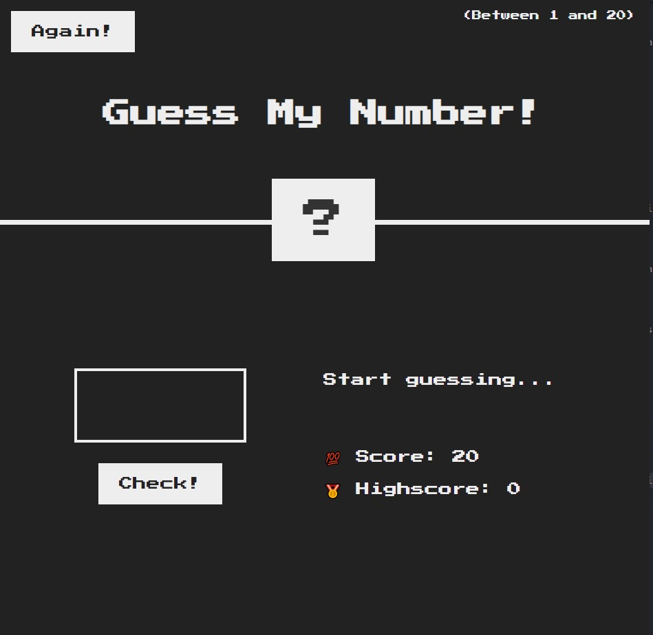
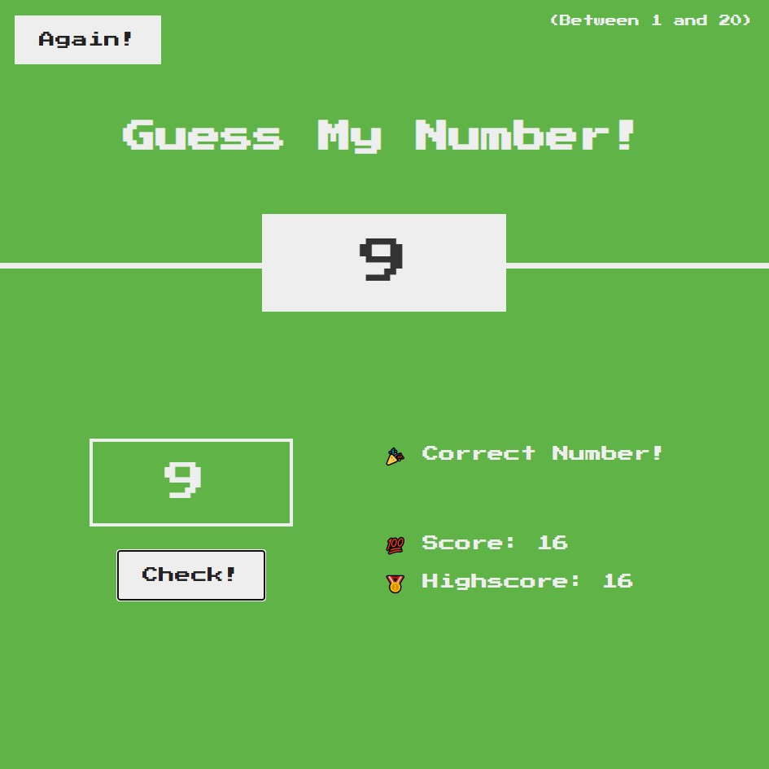

## Guess My Number Game

Welcome to the **Guess My Number** game, a simple and fun number guessing game built with HTML, CSS, and JavaScript!

## How to Play

1. You have to guess a number between 1 and 20.
2. Enter your guess in the input field and click the "Check!" button.
3. You'll receive feedback:
   - If your guess is too high, you'll see "Too High!".
   - If your guess is too low, you'll see "Too Low!".
   - If you don't enter a number, you'll see "No Number!".
4. Keep guessing until you find the correct number.

## Win and Highscore

- When you guess the correct number, you'll see "Correct Number!".
- The background turns green, and the secret number is revealed.
- Your current score is displayed, and if it's higher than the previous highscore, it becomes the new highscore.

## Two-Player Mode

- Challenge a friend in two-player mode to see who can achieve the highest highscore!

## Reset the Game

- Click the "Again!" button to start a new round. The highscore is saved, and your score resets to 20.

## Play Now!

To play the game, follow these steps:

1. **Download the Game Files**: First, download the game files from the main directory.

2. **Unzip the Files**: Extract the downloaded ZIP file to a folder on your computer.

3. **Open the Game**: Locate the "guess-my-number/index.html" file in the extracted folder and double-click it to open the game in your web browser.

4. **Start Guessing**: Now you can start guessing numbers and enjoy the classic gaming experience of the **Guess My Number** game!

Have fun playing the game and competing for the highscore!
