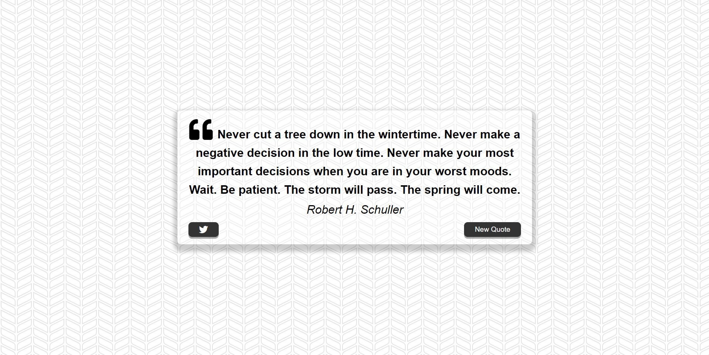

# Quote Generator

Generate inspiring quotes with just a click! The Quote Generator is a simple web application that randomly selects and displays thought-provoking quotes to uplift your spirits and inspire your day.

## Features

- **Random Quotes**: Get a fresh dose of inspiration every time you click the "Generate Quote" button.

- **Shareable**: Easily share your favorite quotes with friends and family on social media.

- **Responsive Design**: The application is designed to work seamlessly on various devices, from desktops to mobile phones.

## Technologies Used

- **HTML**: The structure of the web page.

- **CSS**: Styling and layout of the user interface.

- **JavaScript**: The logic behind generating random quotes and handling user interactions.

## How to Use

1. Clone this repository to your local machine.
2. Open the `index.html` file in your web browser.
3. Click the "Generate Quote" button to see a new inspirational quote each time.
